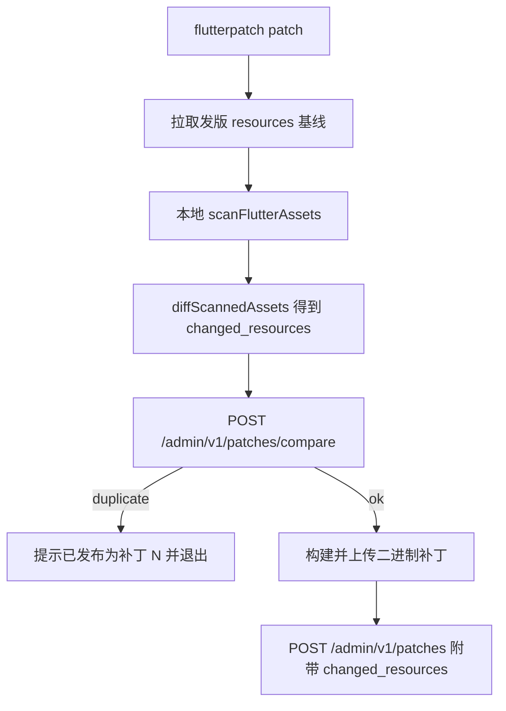

# 补丁变化配置去重计划

## 目标

打补丁时：基于发版基线算出 `changed_resources`（变化配置），与该版本下**已发布**补丁（#1、#2、#3…）逐一比对；若与某一份相同，提示「当前变化配置已发布为补丁 #N」并中止；若都不相同，继续打补丁并把变化配置随补丁上传。



## 设计约定（已拍板）

- **比对对象**：规范化后的 `changed_resources`（相对同一发版 `resources` 基线的增量），不是整表 `resources`/`snapshots`。
- **参与比对的补丁**：同 `(app_id, release_version, platform, arch)` 且 `rolled_back=0`。
- **空增量**：候选 `changed_resources` 为空时**跳过**去重（避免所有「仅 Dart、无资源变动」补丁互相误伤）。
- **发版基线**：patch 流程只**下载**基线做 diff，**不**覆盖写 `resources`/`snapshots`。
- **双闸门**：CLI 上传前调用 compare；`createPatch` 再拦一次返回 409，防止绕过 CLI。
- **强制上传**：请求体 `force: true`（CLI `--force-duplicate-resources`）可跳过拦截。

## 1. 服务端（`/Users/king/Documents/flutterpatch`）

### 1.1 规范化指纹

在 [`services/control_api/lib/services/patch_store.dart`](/Users/king/Documents/flutterpatch/services/control_api/lib/services/patch_store.dart) 增加：

- `_canonicalizeChangedResources(List)`：按 `(package, path)` 排序；每条只保留 `package` / `path` / `hash` / `size` / `change`（及已有的 `package_hash` 若存在）。
- `_changedResourcesFingerprint(...)`：对规范化 JSON 做 SHA-256。

### 1.2 Schema

在 [`services/control_api/lib/db/database.dart`](/Users/king/Documents/flutterpatch/services/control_api/lib/db/database.dart) 为 `patches` 增加列：

- `changed_resources_hash TEXT`（可空）

`createPatch` 写入 `changed_resources` 时同步写入指纹；已有行比对时若 hash 为空则现场从 JSON 计算（兼容旧数据）。同步更新 [`deploy/sql/meta_ota_schema.sql`](/Users/king/Documents/flutterpatch/deploy/sql/meta_ota_schema.sql)（若该文件维护同表）。

### 1.3 `PatchStore.findMatchingPublishedPatch`

输入：`appId, releaseVersion, platform, arch, changedResources`。

逻辑：候选为空 → 返回 null；否则算指纹，查询已发布补丁（优先用列 `changed_resources_hash`，缺失则 decode JSON 再算），返回首个匹配的 `{id, number}`。

### 1.4 新路由

在 [`services/control_api/lib/routes/api.dart`](/Users/king/Documents/flutterpatch/services/control_api/lib/routes/api.dart)：

```http
POST /admin/v1/patches/compare
```

Body：`app_id`, `release_version`, `platform`, `arch`, `changed_resources`。

Response：

- 命中：`{ "duplicate": true, "matching_patch_number": N, "matching_patch_id": "..." }`
- 未命中 / 空增量：`{ "duplicate": false }`

租客鉴权与现有 `POST /admin/v1/patches` 一致（`appBelongsToOrg`）。

### 1.5 `createPatch` / `POST /admin/v1/patches` 拦截

在现有 `createPatch`（约 1994 行）或路由 handler（约 649 行）中：若未 `force: true` 且 `findMatchingPublishedPatch` 命中 → **HTTP 409**，body 含 `error: 'duplicate_changed_resources'`、`matching_patch_number`、`matching_patch_id`。未命中则照常 INSERT（含新 hash 列）。

### 1.6 测试

在 [`services/control_api/test/api_test.dart`](/Users/king/Documents/flutterpatch/services/control_api/test/api_test.dart) 增加：

- compare 命中已发布补丁 number
- 内容不同 → `duplicate: false`
- 空 `changed_resources` → `duplicate: false`
- 已回滚补丁不参与比对
- `POST /patches` 无 force 时 409；`force: true` 可创建

## 2. CLI（`/Users/king/Documents/shorebird`）

### 2.1 Client API

在 [`packages/shorebird_code_push_client/lib/src/code_push_client.dart`](/Users/king/Documents/shorebird/packages/shorebird_code_push_client/lib/src/code_push_client.dart) 增加 `comparePatchResources(...)` → `POST /admin/v1/patches/compare`，解析 `duplicate` / `matching_patch_number`。

### 2.2 Patch 上传前校验

在 [`packages/shorebird_cli/lib/src/commands/patch/patcher.dart`](/Users/king/Documents/shorebird/packages/shorebird_cli/lib/src/commands/patch/patcher.dart) 的 `uploadPatchArtifacts` 中：在算出非空 `changedResources` 之后、`publishPatch` 之前调用 compare。

命中时：

```text
当前变化配置已发布为补丁 #N，跳过上传。
使用 --force-duplicate-resources 可强制继续。
```

然后 `ProcessExit`（非 0）。未命中则走现有 `uploadChangedResourcesToControl` + `publishPatch`。

### 2.3 Flag

在 [`patch_command.dart`](/Users/king/Documents/shorebird/packages/shorebird_cli/lib/src/commands/patch/patch_command.dart) 增加 `--force-duplicate-resources`；`createPatchArtifact` 请求体在 force 时传 `force: true`（[`code_push_client.dart`](/Users/king/Documents/shorebird/packages/shorebird_code_push_client/lib/src/code_push_client.dart) 已有上传路径需透传）。

### 2.4 测试

- Client：compare 响应解析
- Patcher / command：命中则退出；`--force-duplicate-resources` 继续上传

## 3. 明确不做

- 不在 patch 时重写发版 `resources` / `snapshots`
- 不新建 `patch_configs` 全量配置表（沿用 `patches.changed_resources`）
- 第一期不以二进制 `hash` 做去重（仅资源变化配置）

## 关键文件

**flutterpatch**

- [`services/control_api/lib/services/patch_store.dart`](/Users/king/Documents/flutterpatch/services/control_api/lib/services/patch_store.dart)
- [`services/control_api/lib/routes/api.dart`](/Users/king/Documents/flutterpatch/services/control_api/lib/routes/api.dart)
- [`services/control_api/lib/db/database.dart`](/Users/king/Documents/flutterpatch/services/control_api/lib/db/database.dart)
- [`services/control_api/test/api_test.dart`](/Users/king/Documents/flutterpatch/services/control_api/test/api_test.dart)

**shorebird**

- [`packages/shorebird_code_push_client/lib/src/code_push_client.dart`](/Users/king/Documents/shorebird/packages/shorebird_code_push_client/lib/src/code_push_client.dart)
- [`packages/shorebird_cli/lib/src/commands/patch/patcher.dart`](/Users/king/Documents/shorebird/packages/shorebird_cli/lib/src/commands/patch/patcher.dart)
- [`packages/shorebird_cli/lib/src/commands/patch/patch_command.dart`](/Users/king/Documents/shorebird/packages/shorebird_cli/lib/src/commands/patch/patch_command.dart)
